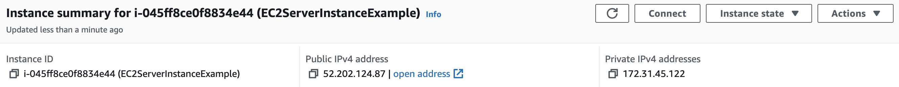

# Goal: To provision an EC2 instance on AWS

# Requirements
I. Get the latest Terraform CLI
    - https://developer.hashicorp.com/terraform/tutorials/aws-get-started/install-cli

II. Get the latest AWS CLI: 
    - https://docs.aws.amazon.com/cli/latest/userguide/getting-started-install.html

III. Get an AWS account and credentials pair for authentication purpose

```bash

# To use our IAM credentials to authenticate the Terraform AWS provider, set the AWS_ACCESS_KEY_ID environment variable.
export AWS_ACCESS_KEY_ID=
# Now, set your secret key.
export AWS_SECRET_ACCESS_KEY=

```

# PHASE I - Plan 

## Create and work on a directory: terraform_doc_101
```bash
mkdir terraform_aws_101
cd terraform_aws_101

```

# Terraform Phase I - PLAN

Create a file called main.tf and add configuration below


```js

terraform {
  required_providers {
    aws = {
      source  = "hashicorp/aws"
      version = "~> 4.16"
    }
  }

  required_version = ">= 1.2.0"
}

provider "aws" {
  region  = "us-east-1"
}

resource "aws_instance" "app_server" {
  ami           = "ami-830c94e3"
  instance_type = "t2.micro"

  tags = {
    Name = "EC2ServerInstanceExample"
  }
}


```

# Terraform Phase II - Initialize
In this phase, Terraform downloads a plugin called a provider that lets Terraform interact with AWS.

```bash 

terraform init

```

## Format and validate coonfiguration we had planned before we provision for the resource

```bash 

terraform fmt
terraform validate


```

# Terraform Phase III - Apply

## This is where Create or modify infrastructure

```bash
terraform apply
```

# Error example


```bash

aws_instance.app_server: Creating...
╷
│ Error: creating EC2 Instance: VPCIdNotSpecified: No default VPC for this user. GroupName is only supported for EC2-Classic and default VPC.
│       status code: 400, request id: b33aaa96-6132-4492-95ca-6d5f8b545c51
│ 
│   with aws_instance.app_server,
│   on main.tf line 16, in resource "aws_instance" "app_server":
│   16: resource "aws_instance" "app_server" {
│ 
╵
```
- Need to create a VPC in us-east-1 region
- Associate a subnet and security group to that VPC. 
- Then we should add the security group ID (vpc_security_group_ids) and subnet ID (subnet_id) arguments to our aws_instance resource


## Updated snipped for my setup

```js

vpc_security_group_ids = ["sg-0572aba9474b6*******"]
  subnet_id            = "subnet-02da5c8da4d2*****"
```

```bash

bigyan@bigyans-MBP terraform_aws_101 % terraform apply
aws_default_vpc.default: Refreshing state... [id=vpc-0d50ccd3b56****]

Terraform used the selected providers to generate the following execution plan. Resource actions are indicated with the following symbols:
  + create

Terraform will perform the following actions:

  # aws_instance.app_server will be created
  + resource "aws_instance" "app_server" {
      + ami                                  = "ami-0583d8c7a9c35822c"
      + arn                                  = (known after apply)
      + associate_public_ip_address          = (known after apply)
      + availability_zone                    = (known after apply)
      + cpu_core_count                       = (known after apply)
      + cpu_threads_per_core                 = (known after apply)
      + disable_api_stop                     = (known after apply)
      + disable_api_termination              = (known after apply)
      + ebs_optimized                        = (known after apply)
      + get_password_data                    = false
      + host_id                              = (known after apply)
      + host_resource_group_arn              = (known after apply)
      + iam_instance_profile                 = (known after apply)
      + id                                   = (known after apply)
      + instance_initiated_shutdown_behavior = (known after apply)
      + instance_state                       = (known after apply)
      + instance_type                        = "t2.micro"
      + ipv6_address_count                   = (known after apply)
      + ipv6_addresses                       = (known after apply)
      + key_name                             = (known after apply)
      + monitoring                           = (known after apply)
      + outpost_arn                          = (known after apply)
      + password_data                        = (known after apply)
      + placement_group                      = (known after apply)
      + placement_partition_number           = (known after apply)
      + primary_network_interface_id         = (known after apply)
      + private_dns                          = (known after apply)
      + private_ip                           = (known after apply)
      + public_dns                           = (known after apply)
      + public_ip                            = (known after apply)
      + secondary_private_ips                = (known after apply)
      + security_groups                      = (known after apply)
      + source_dest_check                    = true
      + subnet_id                            = "subnet-02da5c8da4d23cd6c"
      + tags                                 = {
          + "Name" = "EC2ServerInstanceExample"
        }
      + tags_all                             = {
          + "Name" = "EC2ServerInstanceExample"
        }
      + tenancy                              = (known after apply)
      + user_data                            = (known after apply)
      + user_data_base64                     = (known after apply)
      + user_data_replace_on_change          = false
      + vpc_security_group_ids               = [
          + "sg-0572aba9474b67b37",
        ]

      + capacity_reservation_specification (known after apply)

      + cpu_options (known after apply)

      + ebs_block_device (known after apply)

      + enclave_options (known after apply)

      + ephemeral_block_device (known after apply)

      + maintenance_options (known after apply)

      + metadata_options (known after apply)

      + network_interface (known after apply)

      + private_dns_name_options (known after apply)

      + root_block_device (known after apply)
    }

Plan: 1 to add, 0 to change, 0 to destroy.

Do you want to perform these actions?
  Terraform will perform the actions described above.
  Only 'yes' will be accepted to approve.

  Enter a value: yes

aws_instance.app_server: Creating...
aws_instance.app_server: Still creating... [10s elapsed]
aws_instance.app_server: Still creating... [20s elapsed]
aws_instance.app_server: Still creating... [30s elapsed]
aws_instance.app_server: Still creating... [40s elapsed]
aws_instance.app_server: Creation complete after 42s [id=i-045ff8ce0f8834e44]

Apply complete! Resources: 1 added, 0 changed, 0 destroyed.

```

# Verification
- Go to your console, you should be able to see something like below...


# Destroy 
```bash
terraform destroy
```

# Terraform as Infra state management tool and terraform.tfstate

Most advanced and beautiful tools that I have understood out there have great state management mechanism:
- React = UI component state
- Redux = Application state
- Proof of work consensus in BTC = Global State machine
- Proof of stake consensus in Eth = Global State machine

Looking at Terraform as a Infra state manager using terraform.tfstate has helped me simplify infra management


