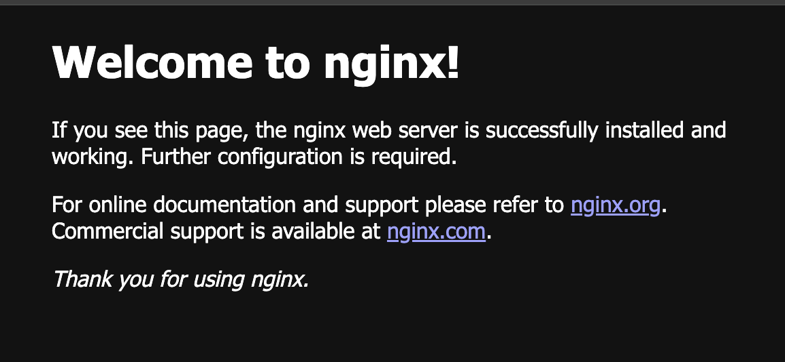

# Install Terraform from Homebrew
brew tap hashicorp/tap
brew install hashicorp/tap/terraform

# To update Terraform if you already have it
brew update 
brew upgrade hashicorp/tap/terraform

# To verify the installation
terraform -help
terraform --version
```bash
bigyan@bigyans-MBP _workspace % terraform --version
Terraform v1.9.0
on darwin_amd64

```

# Start Docker Desktop from your Launchpad or run below command

```bash
open -a Docker

```
## Create and work on a directory: terraform_docker_101
```bash
mkdir terraform_docker_101
cd terraform_docker_101

```

# Terraform Phase I - PLAN

Create a file called main.tf and add configuration below

```js

terraform {
  required_providers {
    docker = {
      source  = "kreuzwerker/docker"
      version = "~> 3.0.2"
    }
  }
}

provider "docker" {}

resource "docker_image" "nginx" {
  name         = "nginx"
  keep_locally = false
}

resource "docker_container" "nginx" {
  image = docker_image.nginx.image_id
  name  = "tutorial"

  ports {
    internal = 80
    external = 8000
  }
}


```
# Terraform Phase II - Initialize

In this phase, Terraform downloads a plugin called a provider that lets Terraform interact with Docker.


```bash

terraform init 

```
- We should be able to see a folder .terraform with necessary plugins inside

# Terraform Phase III - Apply

This is where actual provisioning of resources specified in plan phase takes place. ie. Provisioning of the NGINX server container 

```bash

terraform apply
# when asked  for confirmation, enter yes and press Enter

```

## Verify successful deployment
- Run docker ps to see running container
- Visit localhost:8000 in your web browser



```bash

bigyan@bigyans-MBP _woorkspace % docker ps
CONTAINER ID   IMAGE          COMMAND                  CREATED              STATUS              PORTS                  NAMES
2d219f027c33   e0c9858e10ed   "/docker-entrypoint.…"   About a minute ago   Up About a minute   0.0.0.0:8000->80/tcp   tutorial
```

## To wipe out what we have done so far
```bash

terraform destroy

```